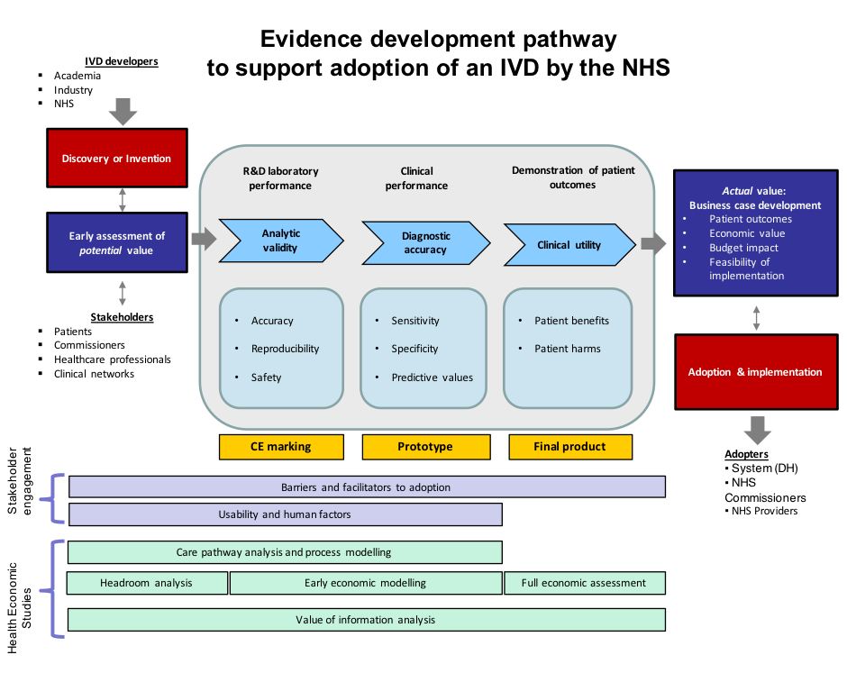

---
output:
  pdf_document:
    fig_caption: yes
    fig_height: 7
    fig_width: 7

title: "Developing a project with the NIHR DEC Newcastle"
author: ""
date: ""
header-includes:
- \usepackage{fancyhdr}
- \pagestyle{fancy}
- \fancyfoot[LE,CE]{\thepage}

 
---
 
***

```{r setup, include=FALSE}
knitr::opts_chunk$set(echo = FALSE)

# A function for captioning and referencing images
# example: ```{r, fig.cap=paste("Your caption.")}
fig <- local({
    i <- 0
    ref <- list()
    list(
        cap=function(refName, text) {
            i <<- i + 1
            ref[[refName]] <<- i
            paste("Figure ", i, ": ", text, sep="")
        },
        ref=function(refName) {
            ref[[refName]]
        })
})

```

#What we do
The Newcastle Diagnostic Evidence Co-operative (DEC) supports industry and academic partners in developing the evidence for new diagnostic tests that would facilitate adoption by the NHS. Support is offered to partners with products at any point on their evidence development pathway, from initial scoping through to fully formed study designs.  

We can support projects that are funded commercially, or through a competitive grant award. The type of funding and the study sponsorship arrangements will affect pricing and may have implications for ownership of intellectual property rights.  

Before developing a project, the DEC requires an NDA (non-disclosure agreement) to be signed by all parties to the project. Clients may find it useful to discuss the intellectual property (IP) agreements at an early stage, as these will form part of the contract with the DEC.  

The DEC’s first step in developing a project is to review an initial outline proposal with the client to ensure that the project meets the client’s needs and is within the DEC’s capabilities and capacities.  

As the Newcastle DEC has excellent working links with the other NIHR DECs, with colleagues in Newcastle University and other universities, we are able to call upon, or refer to, other convenient sources of expertise if the Newcastle DEC is unable to provide the required support.  

Once the initial outline proposal has been agreed, the Newcastle DEC will, with the client, develop a set of detailed work packages and, as required, funding applications and/or study protocols.  

The DEC’s preferred approach is to first understand the key value propositions that the NHS would consider when making a decision as to whether to adopt the product e.g. what evidence is already available (or in the pipeline), and what new evidence is required. Studies can then be planned to provide the evidence, and be sequenced and stage-gated to ensure that the evidence development is capital and cost-efficient. For adoption decisions on a product directly competing with existing products, the NHS is likely to require evidence of equivalence in terms of safety and performance, and evidence on the impact on costs. For adoption decisions on a product that provides novel benefits, the NHS is likely to require evidence of safety and quantification of benefits to patients and/or the NHS and of value for money and affordability.  

The NIHR DEC Newcastle can also support the research approval and regulatory processes, study management, and data management. We can analyse the study’s data, produce detailed reports for the client, and publish results in a high-quality scientific journal — publication in an open access journal is required if the project has received support from the NIHR.  The NIHR publication policy can be reviewed at:  
[nihr.ac.uk/policy-and-standards/publications-policy.htm](http://www.nihr.ac.uk/policy-and-standards/publications-policy.htm)
  

#Evidence to support the key value propositions for a product  




  

The development of a product requires a comprehensive set of evidence to support decisions by investors, regulators, end users, and purchasers.  

Figure 1 outlines the full set of evidence that would be required for rational adoption of a new product that improves quality of care or outcomes at an increased cost.  

The diagram implies a linear process for the main items and parallel processes for others, but in practice the pathway can be more complex. It can also be simpler if the product is a competitor for another product that has been accepted as safe, cost-effective, and affordable. In this case, the evidence development does not need to go beyond showing non-inferiority in terms of safety, accuracy, and cost.  

#What the DEC needs to know to draft a proposal for a project  

The DEC’s first step in supporting a client in developing evidence on their product is to draft a project proposal that will typically contain several work packages. The draft proposal serves as the starting point for jointly finalizing the project specification.  

For the DEC to draft a proposal for evidence development, we will need to understand:  

* The product (including the technology), and the context in which it is to be marketed. For example, the product might be a clinical test, and the relevant context includes the platform on which it runs as well as other tests that can be performed on the platform.  
*	The clinical need (for patients and/or for the NHS).  
* How the product could address the clinical need.  
* What competing products should be taken into account into assessments of differences in performance and economics.  
* What evidence has been generated already, and what is ongoing, and planned for the near future. This set of evidence would ideally be related to the key value propositions that would support rational adoption of the product by the NHS. 

The following checklist could help ensure that an evidence development strategy is cost- and capital-efficient, and leaves no gaps.  

* **Clinical need for individuals.**  

* **Volumes and costs** for service providers  
  
* **Care pathways:** the variation in current practice, guidelines on best practice, controversies (if any) on what constitutes current best practice, and how adoption of the product would change care pathways, workflows, activities, costs, and clinical outcomes.  
	
* **Headroom:** the difference between the maximum price at which the product could be sold and the minimum cost at which it could be produced. This could be a “back of the envelope” calculation to help decide if the product’s potential is above the investor’s risk threshold.  
* **Analytical validity:** the performance of the product as measured in the development laboratory.  
* **Clinical validity:** the safety and performance of the product when measured with clinical samples and in a clinical setting  
* **Clinical utility:** the test’s impact (net benefit) on patient-important outcomes  
* **Cost-effectiveness:** value for the purchaser’s money, and affordability  
* **Usability and human factors**  
* **Adoption planning:** regulatory approvals; barriers to, and facilitators of adoption, which could include evidence on the key value propositions, attitudes to change, usability, financial flows, …  

#Health economics studies
This is a brief overview of the types of health economics studies commonly used to assess IVDs and other medical devices.  

**Care pathway analysis** maps the journey taken by a patient through the healthcare system. It is used to identify the indications for testing and treating, the options that can be taken, and the final outcomes. A care pathway can be used to define optimum management, or to document (variations in) actual management.  

**Decision analysis** turns a care pathway into an analytical model of a decision tree, often using spreadsheet software to do the calculations. The decision tree maps the alternative choices and chance events that can occur along a care pathway, for example whether to choose one or other treatment, and whether the outcome of a test is positive or negative.

Decision analysis compares the final outcomes from different care pathways. The base case is the pathway for current best practice. It is called the base case because new pathways are compared to it.  

The outcomes of interest are costs and net benefit: the difference between benefits and harms.  

Decisions are based on differences in expected outcomes between pathways. An expected outcome is the outcome multiplied by the probability of it happening.  

A decision model has:  

1. Structure — the decision tree  
1. Parameters — the probabilities of choices and chances, the care resources and their costs, and the outcomes: benefits and harms  

**Headroom analysis** is a type of early economic analysis which compares the decision to develop a product (supply) with the decision to buy it (demand). It is used early in the development process to help the manufacturer and their investors decide whether or not to proceed (go/no go decision). A headroom analysis can be little more than a “back of the envelope” calculation in the very early stages of product development, or more detailed modelling when the product is close to being ready for production and marketing.  

**Sensitivity analysis** is used to assess the effects that uncertainties in a model’s parameters have on the model’s results, and to quantify the extant of the uncertainties in the results.  

**Early economic analysis** estimates the likely cost-effectiveness of alternative testing or treating policies under different circumstances such as the possible results of clinical evaluations of the product, and likely variations in production costs and selling price.  

Early economic analyses help identify the parameters which have most effect on the model’s results, and thus inform decisions about (i) investing in resources to more accurately determine certain parameters (ii) target populations for the product; (iii) pricing strategies for the product.  

Early economic models are often the basis for full economic studies.  

**Cost-consequence analysis** compares the costs from following a care pathway with consequences, i.e. the clinical outcomes. A cost-consequences analysis can help inform decisions that budget-holders in service provider organisations must make about the affordability of adopting a product, and thus can support a manufacturer’s adoption planning.  

**Budget impact analysis** goes beyond cost-consequence analysis in that it also takes account of the impact on revenues as well as expenditures resulting from the adoption of a new product. The perspective of budget impact analysis is often that of a local or national decision-maker, and can help decision-makers offset increased expenditure in one budget silo against greater savings in another budget silo.  

**Cost-effectiveness analysis** for the adoption of a product evaluates the impact on costs relative to the impact on net benefits (benefits and harms). The technical name for the measure of cost-effectiveness is the incremental cost-effectiveness ratio, or ICER. If the ICER is below the “willingness to pay” threshold (which is around £20,000 for NICE), adoption of the product is considered to provide value for money.  

**Cost-effectiveness plane**  
The cost-effectiveness plane (shown in Figure 2) is a tool for visualizing the difference that a new product makes to costs and health outcomes, when compared to the base case . It helps understand the decisions that health economists make about investing/commissioning/purchasing a product/medical device/clinical test/drug. 


```{r echo = FALSE, warning=FALSE, message=FALSE, fig.cap="The role of the cost-effectiveness plane in making decisions based on cost-effectiveness."}
knitr::opts_chunk$set(
  echo = FALSE,
  fig.width = 1,
  fig.height = 1,
  fig.align = "right")
# draw cost-effectiveness plane
library(tidyverse)
library(colorspace)
  icer <- 0.75
  xmin <- -100
  xmax <- 100
  ymin <- -100
  ymax <- 100
  nudgeX <- (ymax - ymin)/20
  nudgeY <- (xmax - xmin)/20
 # labels <- data_frame(
    labsX = c(xmin + 1.5*nudgeX, xmax - 1.5*nudgeX, 0, 0)
    labsY = c(0, 0, ymin - nudgeY, ymax + nudgeY)
    labs = c("Decreasing \neffectiveness", "Increasing \neffectiveness", "Decreasing cost", "Increasing cost")
  
  icerThreshold <- data_frame(
    x = c(xmin, xmax),
    y = c(ymin*icer, ymax*icer)
  )
  
   # c("Current product better value", "Not cost-effective", "Cost-effective", "New product better value", "New product cheaper,/nbut less value"),
  
  # id = c("A", "B1", "B2", "C", "D2", "D1"),
  
  
  quadrantA <- data.frame(
    id = c("A", "A", "A", "A"),
    x = c(xmin + nudgeX,  xmin + nudgeX,  -nudgeX, -nudgeX),
    y = c(nudgeY, ymax - nudgeY, ymax - nudgeY, nudgeY),
    fillvalue = rep(c(0), 4)
  )
 
  quadrantB1 <- data.frame(
    id = c("B1", "B1", "B1", "B1"),
    x = c(nudgeX, nudgeX, xmax - nudgeX, xmax - nudgeX),
    y = c(nudgeY + icer*nudgeX, ymax - nudgeY, ymax - nudgeY, icer*(xmax - nudgeX) + nudgeY),
    fillvalue = rep(c(1), 4)
  )
  
  quadrantB2 <- data.frame(
    id = c("B2", "B2", "B2"),
    x = c(nudgeX + nudgeY/icer, xmax - nudgeX, xmax - nudgeX),
    y = c(nudgeY, nudgeY, icer*(xmax - nudgeX) - nudgeY),
    fillvalue = rep(c(2), 3)
  )

  
    quadrantC <- data.frame(
    id = c("C", "C", "C", "C"),
    x = c(nudgeX, xmax - nudgeX, xmax - nudgeX, nudgeX),
    y = c(-nudgeY, -nudgeY, ymin + nudgeY, ymin + nudgeY),
    fillvalue = rep(c(3), 4)
  )
  
    quadrantD1 <- data.frame(
      id = c("D1", "D1", "D1", "D1"),
      x = c(-nudgeX, -nudgeX, xmin + nudgeX, xmin + nudgeX),
      y = c(-nudgeY - icer*nudgeX, ymin + nudgeY, ymin + nudgeY, icer*(xmin + nudgeX) - nudgeY),
      fillvalue = rep(c(2), 4)
    )
    
    quadrantD2 <- data.frame(
      id = c("D2", "D2", "D2"),
      x = c(-nudgeX - nudgeY/icer, xmin + nudgeX, xmin + nudgeX),
      y = c(-nudgeY, - nudgeY, icer*(xmin + nudgeX) + nudgeY),
      fillvalue = rep(c(1), 3)
    )
  
  cep <- ggplot(icerThreshold, aes(x, y), width = 7, height = 7) + 
    coord_fixed(ratio = 1, xlim = NULL, ylim = NULL, expand = TRUE) +
    geom_segment(aes(x = xmin, y = xmin*icer, xend = xmax, yend = xmax*icer), size = 1, colour ="seagreen") +
    annotate("text", x = 75, y = icer*75, label = "ICER\nwillingness to pay threshold", angle = atan(icer)*180/pi, colour ="seagreen") +
    #annotate("text", x = 50, y = icer*50, label = "ICER\nwillingness to pay threshold", angle = 23, colour ="seagreen") +
    
    geom_segment(aes(x = 0, y = ymin, xend = 0, yend = ymax), arrow = arrow(ends = "both", length = unit(0.075, "inches")), size = 1) +
    geom_segment(aes(x = xmin, y = 0, xend = xmax, yend = 0), arrow = arrow(ends = "both", length = unit(0.075, "inches")), size = 1) +
    annotate("text", x = labsX, y = labsY, label = labs) +
    geom_polygon(data=quadrantA, aes(x=x, y=y, fill=fillvalue, alpha = 0.5)) +
    annotate("text", x = -50, y = 50, label = "A\nIncreased cost\nLess effective \n = Disinvest") +
  
    geom_polygon(data=quadrantB1, aes(x=x, y=y, fill=fillvalue)) +
    annotate("text", x = 35, y = 75, label = "B1\nIncreased cost\nMore effective \n = Poor value") +
    
    geom_polygon(data=quadrantB2, aes(x=x, y=y, fill=fillvalue)) +
    annotate("text", x = 70, y = 25, label = "B2\nIncreased cost\nMore effective \n = Good value") +
    
    geom_polygon(data=quadrantC, aes(x=x, y=y, fill=fillvalue, alpha =0.5)) +
    annotate("text", x = 50, y = -50, label = "C\nDecreased cost\nMore effective \n = Invest") +
    
    geom_polygon(data=quadrantD1, aes(x=x, y=y, fill=fillvalue)) +
    annotate("text", x = -35, y = -75, label = "D1\nDecreased cost\nLess effective   \n = ?Good value") +
    
    geom_polygon(data=quadrantD2, aes(x=x, y=y, fill=fillvalue)) +
    annotate("text", x = -70, y = -25, label = "D2\nDecreased cost\nLess effective   \n = ?Poor value") +
    
    
    theme(legend.position = "none") +
    scale_fill_gradientn(colours = colorspace::diverge_hcl(4, h = c(0, 100)))
  
  cep
    # setwd("/Users/michaelpower/Google Drive/GIT-project/GitHub/R-tools/Diagrams")
    # ggsave("cost-effectiveness plane.png", width = 7, height = 7, units = "in") # set the file path to where you want it to go
```


The graph shows the difference in effectiveness along the x-axis, and the difference in costs along the y-axis — when comparing the impact of a new product with that from the base case.  

Because there is zero difference in costs and zero difference in effectiveness when the base case is compared with itself, it maps to the origin.  

The new product is “mapped” this way to a point in one of the 6 shaded areas in the plane shown in Figure 2. For example, the product could be mapped to point A, B1, B2, C, D1, or D2:  

**Quadrant A**  

\setlength{\leftskip}{1cm}  

Products that cost more, but are less effective are mapped to this quadrant. The rational decisions about investing in these products is clearly to invest elsewhere.  

\setlength{\leftskip}{0cm}

**Quadrant B**

\setlength{\leftskip}{1cm}

Products that cost more, and are more effective need to be assessed for the value that would be provided were they to be adopted.  

The green transverse line shows the threshold above which the product would be considered poor value (B1), and below which it would be considered good value (B2).  
    
Because there are uncertainties in health economic studies, the threshold line is broader and fuzzier than shown, as the value of products near the line needs to be assessed with careful judgement.  

\setlength{\leftskip}{0cm}

**Quadrant C**

\setlength{\leftskip}{1cm}

Products that cost less while being more effective make easy investment decisions as they clearly provide better value than the alternative.  

\setlength{\leftskip}{0cm}

**Quadrant D**

\setlength{\leftskip}{1cm}

Products that cost less while being less effective require a value judgement about the benefit of the savings relative to the savings. 

Products below the transverse green line (D1) may provide an opportunity for savings, while those above the line may not be good value.  

\setlength{\leftskip}{0cm}


#Assessing uncertainties in health economic studies
As with any study, the results from a health economic study have inherent uncertainties. These can be displayed as a cloud of points, for example from a sensitivity analysis — not shown here. When the cloud of points approaches, or crosses the ICER line, judgement is necessary to assess the interpretation of the analysis. One way of doing this is to have upper and lower ICER thresholds for decision makers to refer to.   
  
  
***

#When the DEC works with other companies  
To ensure confidentiality is maintained, the DEC will sign a CDA before starting to work with a company. There are two issues that may need discussion before contracts are agreed:  

1. The DEC could have worked, or are currently working, or may work in the future with companies that could be or will become direct competitors of your product. We will not be sharing any confidential information about your product with them (or vice versa). 

2. The know-how, the identification of clinical need, the care pathways, any useful networks or collaboration or source of information obtained from past projects may be re-used or adapted for your project (and vice versa).


***


Copyright Diagnostic Evidence Co-operative Newcastle 7th Novenber 2017.
